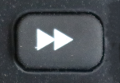
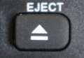

###Remote Info

- Manufacturer: Coolux
- Model # : LYSB01DVU2QSY-ELECTRNCS
- Website: [Amazon](https://www.amazon.com/dp/B01DVU2QSY)


### Flirc Configuration

The following is a presentation of the Flirc key mapping for the above remote. The long press button programming requires a newer Flirc v2 device.


#### Flirc Key Mapping


| Button                  | Flirc | Action | Long Press | Action |
| ----------------------- | :---: | ------ | ---------- | ------ |
|  | `S` | Shutdown Menu | `CTRL` + `SHIFT` + `ALT` + `R` | **Restart Kodi |
|   | `ESC` | Back |  |  |
|   | `,` | Previous |            |        |
|   | `X` | Stop |            |        |
|   | `.` | Next |            |        |
|   | `R` | Rewind |            |        |
|   | `Play/Pause` | Play/Pause |            |        |
|   | `F` | Fast Forward |            |        |
|    | `CTRL` + `I` | *Latest TV |            |        |
|  | `CTRL` + `E` | *Latest Movies |            |        |
|  | `CTRL` + `T` | *Music/Artists |            |        |
|  | `CTRL` + `M` | *Weather |            |        |
|  | `DELETE` | Back |            |        |
|  | `C` | Menu/Options |            |        |
|  | ` ↑` | Up |            |        |
|  | ` ←` | Left |            |        |
|  | `ENTER` | Enter/OK |            |        |
|  | ` →` | Right |            |        |
|  | ` ↓` | Down |            |        |
|  | `PGDN` | Page - |            |        |
|  | `PGUP` | Page + |            |        |
|  | `T` | Toggle Subtitles |            |        |
|  | `F8` | Toggle Mute |            |        |
|  | `I` | Info |            |        |
|  | `CTRL` + `A` | Next Audio Stream |            |        |
|  | `[0-9]` | Numbers 0-9 |            |        |
|  | `CTRL` + `ALT` + `S` | *Search | `CTRL` + `ALT` + `P` | *Update Library |
|  | `CTRL` + `ALT` + `Q` | N/A | `CTRL` + `ALT` + `E` | **Toggle Desktop/Kodi |

_* Customized in Kodi Keymap_                       _** Customized in xkeybind_

####Flirc Dump

This is the output produced by `flirc_util keys`

```
Recorded Keys:
Index  hash       IK   ID  key
-----  --------   ---  --  ---
    0  5AD96230   052  01    up
    1  06993E30   052  01    down
    2  C6697430   052  01    left
    3  68CCE230   051  01    right
    4  D8F05030   052  01    return
    5  08E3F430   052  01    3
    6  A65AE230   052  01    1
    7  36377430   051  01    2
    8  6ABE7430   052  01    4
    9  FA9B0630   052  01    5
   10  41401830   052  01    6
   11  658C9830   052  01    7
   12  D5B00630   051  01    8
   13  D11CAA30   051  01    9
   14  63E06230   051  01    0
   15  368CE230   052  01    escape
   16  A1C78630   052  01    backspace
   17  98220630   052  01    F8
   18  44806230   052  02    play/pause
   19  CAFCD030   052  01    x
   20  662B1830   052  01    r
   21  D64E8630   052  01    f
   22  72295030   052  01    ,
   23  9675D030   052  01    .
   24  11EAF430   052  01    c
   25  01676230   052  01    i
   26  9D53E230   052  01    t
   27  2D307430   052  01    left_ctrl A
   28  3F93E230   052  01    s
   29  3F93E230   000  01    left_ctrl+left_shift+left_alt R
   30  2843F430   052  01    left_ctrl E
   31  98676230   052  01    left_ctrl I
   32  93D40630   052  01    left_ctrl M
   33  03F77430   052  01    left_ctrl T
   34  B16D39AC   052  01    pageup
   35  46BC20C9   061  01    pagedown
   36  0205E230   052  01    pageup
   37  08457430   052  01    pagedown
   38  98C08630   051  01    left_ctrl+left_alt S
   39  98C08630   000  01    left_ctrl+left_alt P
   40  D403D030   130  01    left_ctrl+left_alt Q
   41  D403D030   000  01    left_ctrl+left_alt E
```


### Kodi Keymap

The keymap contains any changes or additions to the default keymap, reference the [Kodi Wiki](https://kodi.wiki/view/keymap) for details.

``` xml
<keymap>
    <global>
        <keyboard>
            <!-- 
                Custom Keymap      
                Remote : coolux-wd
                Model  : LYSB01DVU2QSY-ELECTRNCS
                Link   : https://www.amazon.com/dp/B01DVU2QSY
            -->
            
            <!-- Button: Green     -->
            <!-- Action: Recent TV -->
            <i mod="ctrl">ActivateWindow(Videos,RecentlyAddedEpisodes)</i>
            
            <!-- Button: Red           -->
            <!-- Action: Recent Movies -->
            <e mod="ctrl">ActivateWindow(Videos,RecentlyAddedMovies)</e>
            
            <!-- Button: Yellow        -->
            <!-- Action: Music/Artists -->
            <t mod="ctrl">ActivateWindow(Music,Artists)</t>
            
            <!-- Button: Blue    -->
            <!-- Action: Weather -->
            <m mod="ctrl">ActivateWindow(Weather)</m>
            
            <!-- Button: Next Page -->
            <!-- Action: Page +    -->
            <pageup>pagedown</pageup>
            
            <!-- Button: Prev Page -->
            <!-- Action: Page -    -->
            <pagedown>pageup</pagedown>
            
            <!-- Button: Search        -->
            <!-- Action: Search Window -->
            <s mod="ctrl,alt">ActivateWindow(11107)</s>
            
            <!-- Button: Search (Long Press)  -->
            <!-- Action: Update Video Library -->
            <p mod="ctrl,alt">XBMC.updatelibrary(Video)</p>
            
            <!-- Button: Audio             --> 
            <!-- Action: Next Audio Stream -->
            <a mod="ctrl">AudioNextLanguage</a>
        </keyboard>
    </global>
</keymap>
```


### xbindkeys

Using [xbinkeys](https://linux.die.net/man/1/xbindkeys) we can use the remote to launch various scripts, this is used to automate some actions that are just not possible with default Kodi mappings.

If we run xbinkeys during lightdm startup it'll be started with root authority, this further expands the actions that can be performed from the remote since we're no longer limited by the Kodi users auth subset.


#### LightDM Configuration

Update the lightdm configuration to autostart xbindkeys 

`/etc/lightdm/lightdm.conf.d/kodi.conf`

```ini
#----------------------
# LightDM Config
#----------------------

# Launch xbinkeys on startup
# Will run in root auth
[SeatDefaults]
display-setup-script=xbindkeys -X :0 -f /etc/lightdm/xbindkeys-config

# Autologin User & Startup Kodi
[Seat:*]
autologin-user=kodi
autologin-user-timeout=0
autologin-session=kodi
greeter-session=lightdm-gtk-greeter
```


#### Xbindkeys Configuration

`/etc/lightdm/xbindkeys-config`

```bash
#----------------------
# xbindkeys-config
#----------------------

#---------------------------------------------
# Remote Info
# ---------------------------------------------
# Remote : coolux-wd 
# Model  : LYSB01DVU2QSY-ELECTRNCS
# Link   : https://www.amazon.com/dp/B01DVU2QSY

#----------------------------------------------
# Button : Power (Long Press)
# Keys   : CTRL + SHIFT + ALT + R
# Action : Restart Lightdm & Kodi
#----------------------------------------------
"systemctl restart lightdm.service"
  control+shift+alt + r

#----------------------------------------------
# Button : Eject (Long Press)
# Keys   : CTRL + ALT + E
# Action : Toggle Desktop/Kodi
#----------------------------------------------
"sed -i '/^autologin-session=/{s/kodi/xubuntu/;t;s/xubuntu/kodi/}' /etc/lightdm/lightdm.conf.d/kodi.conf && systemctl restart lightdm.service"
  control+alt + e

```


